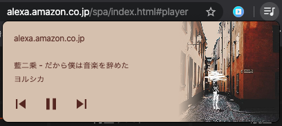

# alexa-spa-global-media-controls

[Alexa SPA](https://alexa.amazon.co.jp/spa/index.html#player) を Google Chrome 79+ から追加された Global Media Controls を追加する拡張です。
Amazon Echo で音楽を再生している時に、曲名を Google Chrome から確認できて便利です。

Proof of concept の側面が強いので動きが若干怪しいです。

#### イメージ

## インストール

リポジトリをクローンし、Chrome の拡張機能から「パッケージ化されていない拡張機能を読み込む」で読み込んでください。

## ライセンス

MIT.

## クレジット
アイコンは https://developer.amazon.com/ja/docs/tools/icon-builder.html で作成しました。
